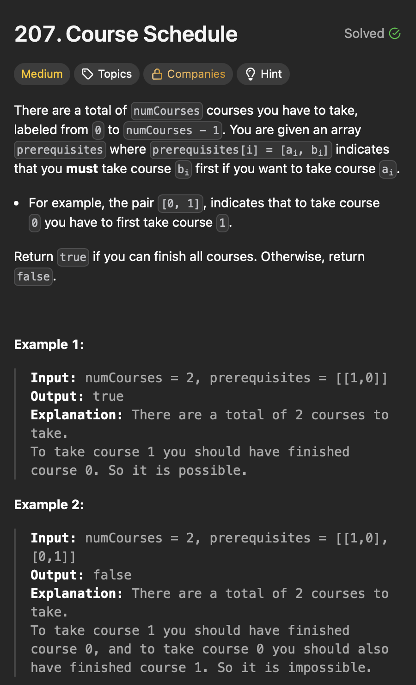
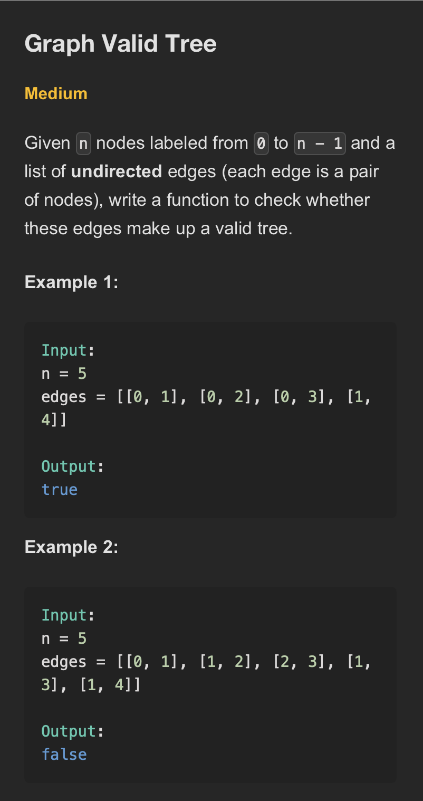

# **Graphs**

## **Graph Representation**
```java
class Node {
    int val;
    List<Node> neighbors;

    Node() {
        val = 0;
        neighbors = new ArrayList<>();
    }

    Node(int val) {
        this.val = val;
        neighbors = new ArrayList<>();
    }

    Node(int val, List<Node> neighbors) {
        this.val = val;
        this.neighbors = neighbors;
    }
}

public class Graph {
    public static void main(String[] args) {
        Node node1 = new Node(11);
        Node node2 = new Node(22);
        Node node3 = new Node(33);
        Node node4 = new Node(44);

        node1.neighbors.add(node2);
        node1.neighbors.add(node4);
        node2.neighbors.add(node1);
        node2.neighbors.add(node3);
        node3.neighbors.add(node2);
        node3.neighbors.add(node4);
        node4.neighbors.add(node3);
        node4.neighbors.add(node1);

        printGraph(Arrays.asList(node1, node2, node3, node4));
    }

    static void printGraph(List<Node> graph) {
        for (Node node : graph) {
            System.out.print("Node " + node.val + " ->");
            for (Node neighbour : node.neighbors) {
                System.out.print(neighbour.val + " ");
            }
        }
        System.out.println();
    }

}
```
## **Number of Islands**
<div align="center">
  
</div>

#### Optimal -

```java
public class NumberOfIslands {
    public static void main(String[] args) {
        char[][] grid = {
                { '1', '1', '0', '0', '0' },
                { '1', '1', '0', '0', '1' },
                { '0', '0', '0', '1', '1' },
                { '0', '0', '0', '0', '0' },
                { '1', '0', '1', '0', '1' }
        };

        System.out.println("Number of islands: " + numberOfislands(grid));
    }

    private static int numberOfislands(char[][] grid) {
        int numIslands = 0;
        int rows = grid.length;
        int cols = grid[0].length;

        for (int row = 0; row < rows; row++) {
            for (int col = 0; col < cols; col++) {
                if (grid[row][col] == '1') {
                    numIslands++;
                    dfs(grid, row, col);
                }
            }
        }
        return numIslands;
    }

    private static void dfs(char[][] grid, int row, int col) {
        if (row < 0 || row >= grid.length || col < 0 || col >= grid[0].length || grid[row][col] == '0') {
            return;
        }
        grid[row][col] = '0';

        dfs(grid, row - 1, col);
        dfs(grid, row + 1, col);
        dfs(grid, row, col - 1);
        dfs(grid, row, col + 1);
    }
}
```
>Time Complexity - O(m x n) 
- m is number of rows.
- n is number of columns.
>Space Complexity - O(m x n) 

#### Explanation

-

#### Steps

-

#### Follow up 

-

## **Max Area of Island**
<div align="center">
  
</div>

#### Brute - 

```java

```
>Time Complexity - 

>Space Complexity - 
#### Explanation

-

#### Steps

-


#### Optimal -

```java
public class MaxAreaOfIsland {
    public static void main(String[] args) {
        int[][] grid = {
                { 0, 0, 1, 0, 0, 0, 0, 1, 0, 0, 0, 0, 0 },
                { 0, 0, 0, 0, 0, 0, 0, 1, 1, 1, 0, 0, 0 },
                { 0, 1, 1, 0, 1, 0, 0, 0, 0, 0, 0, 0, 0 },
                { 0, 1, 0, 0, 1, 1, 0, 0, 1, 0, 1, 0, 0 },
                { 0, 1, 0, 0, 1, 1, 0, 0, 1, 1, 1, 0, 0 },
                { 0, 0, 0, 0, 0, 0, 0, 0, 0, 0, 1, 0, 0 },
                { 0, 0, 0, 0, 0, 0, 0, 1, 1, 1, 0, 0, 0 },
                { 0, 0, 0, 0, 0, 0, 0, 1, 1, 0, 0, 0, 0 }
        };
        System.out.println("Max Area of Island: " + maxAreaOfIsland(grid));
    }

    private static int maxAreaOfIsland(int[][] grid) {
        int maxArea = 0;
        int rows = grid.length;
        int cols = grid[0].length;

        for (int row = 0; row < rows; row++) {
            for (int col = 0; col < cols; col++) {
                if (grid[row][col] == 1) {
                    maxArea = Math.max(maxArea, dfs(grid, row, col));
                }
            }
        }
        return maxArea;
    }

    private static int dfs(int[][] grid, int row, int col) {
        if (row < 0 || row >= grid.length || col < 0 || col >= grid[0].length || grid[row][col] == 0) {
            return 0;
        }

        grid[row][col] = 0;

        // Each 1 contributes +1 to the total area, so the final sum gives the island
        // size.
        return 1 + dfs(grid, row + 1, col) + dfs(grid, row - 1, col) + dfs(grid, row, col + 1)
                + dfs(grid, row, col - 1);
    }
}
```
>Time Complexity - O(m * n)
- Each cell is visited once.
>Space Complexity - O(m * n)
- In worst-case scenario each cell is visited once.
#### Explanation

-

#### Steps

-

#### Follow up 

-

## **Clone Graph**
<div align="center">
  
</div>

#### Brute - 

```java

```
>Time Complexity - 

>Space Complexity - 
#### Explanation

-

#### Steps

-

#### Optimal -

```java
class Node {
    int val;
    List<Node> neighbors;

    Node() {
        val = 0;
        neighbors = new ArrayList<>();
    }

    Node(int val) {
        this.val = val;
        neighbors = new ArrayList<>();
    }

    Node(int val, List<Node> neighbors) {
        this.val = val;
        this.neighbors = neighbors;
    }
}
public class CloneGraph {
    public static void main(String[] args) {
        Node node1 = new Node(11);
        Node node2 = new Node(22);
        Node node3 = new Node(33);
        Node node4 = new Node(44);

        node1.neighbors.add(node2);
        node1.neighbors.add(node4);
        node2.neighbors.add(node1);
        node2.neighbors.add(node3);
        node3.neighbors.add(node2);
        node3.neighbors.add(node4);
        node4.neighbors.add(node3);
        node4.neighbors.add(node1);

        Node cloneGraph = cloneGraph(node1);
        System.out.println("Cloned graph node value: " + cloneGraph.val);
        for (Node neighbor : cloneGraph.neighbors) {
            System.out.println("Neighbor:" + neighbor.val);
        }
    }

    private static Node cloneGraph(Node node) {
        if (node == null)
            return null;

        Map<Node, Node> visited = new HashMap<>();

        return dfs(node, visited);
    }

    private static Node dfs(Node node, Map<Node, Node> visited) {
        if (visited.containsKey(node))
            return visited.get(node);

        Node clone = new Node(node.val);
        visited.put(node, clone);

        for (Node neighbor : node.neighbors) {
            clone.neighbors.add(dfs(neighbor, visited));
        }

        return clone;
    }
}
```
>Time Complexity - O(V + E)
- V number of nodes(vertices).
- E number of edges.
- Each edge is visited once, each node is cloned once.
- DFS ensures linear time.

>Space Complexity - O(V)
- Map and Recursion stack
#### Explanation

-

#### Steps

-

#### Follow up 

-

## **Rotting Oranges**
<div align="center">
  
</div>

#### Brute - 

```java

```
>Time Complexity - 

>Space Complexity - 
#### Explanation

-

#### Steps

-


#### Optimal -

```java
public class RottingOrangesI {
    public static void main(String[] args) {
        int[][] grid = {
                { 2, 1, 1 },
                { 1, 1, 0 },
                { 0, 1, 1 }
        };
        System.out.println("Minutes to rot all oranges: " + rottingOranges(grid));
    }

    private static int rottingOranges(int[][] grid) {
        if (grid == null || grid.length == 0) {
            return -1;
        }

        int rows = grid.length;
        int cols = grid[0].length;

        Queue<int[]> queue = new LinkedList<>();
        int freshOranges = 0;
        int minutes = 0;

        for (int row = 0; row < rows; row++) {
            for (int col = 0; col < cols; col++) {
                if (grid[row][col] == 2) {
                    queue.offer(new int[] { row, col });
                } else if (grid[row][col] == 1) {
                    freshOranges++;
                }
            }
        }

        if (freshOranges == 0) {
            return 0;
        }

        while (!queue.isEmpty()) {
            int size = queue.size();
            boolean rotOcurred = false;

            for (int i = 0; i < size; i++) {
                int[] current = queue.poll();
                int row = current[0];
                int col = current[1];

                if (row - 1 >= 0 && grid[row - 1][col] == 1) {
                    grid[row - 1][col] = 2;
                    queue.offer(new int[] { row - 1, col });
                    freshOranges--;
                    rotOcurred = true;
                }

                if (row + 1 < rows && grid[row + 1][col] == 1) {
                    grid[row + 1][col] = 2;
                    queue.offer(new int[] { row + 1, col });
                    freshOranges--;
                    rotOcurred = true;
                }

                if (col - 1 >= 0 && grid[row][col - 1] == 1) {
                    grid[row][col - 1] = 2;
                    queue.offer(new int[] { row, col - 1 });
                    freshOranges--;
                    rotOcurred = true;
                }

                if (col + 1 < cols && grid[row][col + 1] == 1) {
                    grid[row][col + 1] = 2;
                    queue.offer(new int[] { row, col + 1 });
                    freshOranges--;
                    rotOcurred = true;
                }
            }
            if (rotOcurred) {
                minutes++;
            }
        }
        return (freshOranges == 0) ? minutes : -1;
    }
}

```
>Time Complexity - 

>Space Complexity - 
#### Explanation
- Instead of writing four separate conditions, we can handle like below
```java
int[] directions = { 0, 1, 0, -1, 0 };
        while (!queue.isEmpty()) {
            int size = queue.size();
            boolean rotOccured = false;

            for (int i = 0; i < size; i++) {
                int[] current = queue.poll();
                int row = current[0];
                int col = current[1];

                for (int j = 0; j < 4; j++) {
                    int newRow = row + directions[j];
                    int newCol = col + directions[j + 1];

                    if (newRow >= 0 && newRow < rows && newCol >= 0 && newCol < cols && grid[newRow][newCol] == 1) {
                        grid[newRow][newCol] = 2;
                        queue.offer(new int[] { newRow, newCol });
                        freshOranges--;
                        rotOccured = true;
                    }
                }
            }
            if (rotOccured) {
                minutes++;
            }
        }
```

#### Steps

-

#### Follow up 

-


## **Pacific Atlantic Water Flow**
<div align="center">
  
</div>
<div align="center">
  
</div>

#### Brute - 
>Time Complexity - 

>Space Complexity - 
```java

```
#### Explanation

-

#### Steps

-

#### Optimal -
```java
public class PacificAtlanticWaterFlow {
    public static void main(String[] args) {
        int[][] heights = {
                { 1, 2, 2, 3, 5 },
                { 3, 2, 3, 4, 4 },
                { 2, 4, 5, 3, 1 },
                { 6, 7, 1, 4, 5 },
                { 5, 1, 1, 2, 4 }
        };
        List<List<Integer>> results = pacificAtlanticFlow(heights);
        System.out.println(results);
    }

    private static List<List<Integer>> pacificAtlanticFlow(int[][] heights) {
        int rows = heights.length;
        int cols = heights[0].length;
        List<List<Integer>> results = new ArrayList<>();

        boolean[][] pacific = new boolean[rows][cols];
        boolean[][] atlantic = new boolean[rows][cols];

        for (int i = 0; i < rows; i++) {
            dfs(heights, i, 0, pacific, Integer.MIN_VALUE);// Pacific left border
            dfs(heights, i, cols - 1, atlantic, Integer.MIN_VALUE);// Atlantic right border
        }

        for (int j = 0; j < cols; j++) {
            dfs(heights, 0, j, pacific, Integer.MIN_VALUE);// Pacific top border
            dfs(heights, rows - 1, j, atlantic, Integer.MIN_VALUE);// Atlantic bottom border
        }

        // Collect cells that can reach both oceans
        for (int row = 0; row < rows; row++) {
            for (int col = 0; col < cols; col++) {
                if (atlantic[row][col] && pacific[row][col]) {
                    results.add(Arrays.asList(row, col));
                }
            }
        }
        return results;
    }

    private static void dfs(int[][] heights, int row, int col, boolean[][] visited, int prevHeight) {
        // Stop if out of bounds, already visited, or can't flow
        if (row < 0 || row >= heights.length || col < 0 || col >= heights[0].length || visited[row][col]
                || heights[row][col] < prevHeight) {
            return;
        }

        visited[row][col] = true;

        dfs(heights, row - 1, col, visited, heights[row][col]);
        dfs(heights, row + 1, col, visited, heights[row][col]);
        dfs(heights, row, col - 1, visited, heights[row][col]);
        dfs(heights, row, col + 1, visited, heights[row][col]);
    }
}

/**
 * Output
 * [[0, 4], [1, 3], [1, 4], [2, 2], [3, 0], [3, 1], [4, 0]]
 * 
 * 
 * corresponding coordinates
 * [5, 4, 4, 5, 6, 7, 5]
 */
```

>Time Complexity - O(m x n)
- Each cell is visited at most once.
- m is number of rows.
- n is number of columns.

>Space Complexity - O(m x n)
- recursion stack.

#### Explanation

-

#### Steps

-

#### Follow up 

-

## **Surrounded Regions**
<div align="center">
  
</div>

#### Brute - 

```java

```
>Time Complexity - 

>Space Complexity - 
#### Explanation

-

#### Steps

-


#### Optimal -

```java
public class SurroundedRegions {
    public static void main(String[] args) {
        char[][] board = {
                { 'X', 'X', 'X', 'X' },
                { 'X', 'O', 'O', 'X' },
                { 'X', 'X', 'O', 'X' },
                { 'X', 'O', 'X', 'X' }
        };
        System.out.println("Original Board:");
        printBoard(board);

        surroundedRegions(board);

        System.out.println("\nBoard after solving:");
        printBoard(board);
    }

    private static void surroundedRegions(char[][] board) {
        if (board == null || board.length == 0) {
            return;
        }
        int rows = board.length;
        int cols = board[0].length;
        Queue<int[]> queue = new LinkedList<>();

        // Identify all 'O's on the borders
        for (int i = 0; i < rows; i++) {
            if (board[i][0] == 'O') {
                queue.offer(new int[] { i, 0 });
            }
            if (board[i][cols - 1] == 'O') {
                queue.offer(new int[] { i, cols - 1 });
            }
        }
        for (int j = 0; j < cols; j++) {
            if (board[0][j] == 'O') {
                queue.offer(new int[] { 0, j });
            }
            if (board[rows - 1][j] == 'O') {
                queue.offer(new int[] { rows - 1, j });
            }
        }

        // Identify all 'O's connected to the borders and mark them as safe 'T'
        while (!queue.isEmpty()) {
            int[] cell = queue.poll();
            int row = cell[0];
            int col = cell[1];

            if (board[row][col] == 'O') {
                board[row][col] = 'T';
            }

            if (row - 1 >= 0 && board[row - 1][col] == 'O') {
                queue.offer(new int[] { row - 1, col });
            }

            if (row + 1 < rows && board[row + 1][col] == 'O') {
                queue.offer(new int[] { row + 1, col });
            }

            if (col - 1 >= 0 && board[row][col - 1] == 'O') {
                queue.offer(new int[] { row, col - 1 });
            }

            if (col + 1 < cols && board[row][col + 1] == 'O') {
                queue.offer(new int[] { row, col + 1 });
            }
        }
        // Convert remaining 'O' to 'X' and restore 'T' to 'O'
        for (int i = 0; i < rows; i++) {
            for (int j = 0; j < cols; j++) {
                if (board[i][j] == 'O') {
                    board[i][j] = 'X';
                } else if (board[i][j] == 'T') {
                    board[i][j] = 'O';
                }
            }
        }
    }

    public static void printBoard(char[][] board) {
        for (char[] row : board) {
            for (char cell : row) {
                System.out.print(cell + " ");
            }
            System.out.println();
        }
    }
}
```
>Time Complexity - O(m × n)

>Space Complexity - O(m × n)
#### Explanation

-

#### Steps

-

#### Follow up 

-

## **Course Schedule**
<div align="center">
  
</div>

#### Optimal - Topological Sort(Kahns Algorithm)
```java
public class CourseSchedule{
  public static void main(String[] args) {
    // Example 1: Possible to finish all courses
    int numCourses1 = 4;
    int[][] prerequisites1 = { { 1, 0 }, { 2, 1 }, { 3, 2 } };
    System.out.println(courseScheduleBFS(numCourses1, prerequisites1)); // Output:
    // true

    // Example 2: Cycle exists
    int numCourses2 = 2;
    int[][] prerequisites2 = { { 1, 0 }, { 0, 1 } };
    System.out.println(courseScheduleBFS(numCourses2, prerequisites2)); // Output:
    // false
  }

  private static boolean courseScheduleBFS(int numCourses, int[][] prerequisites) {
    // Step 1: Build adjacency list graph  
    List<List<Integer>> adjacencyGraph = new ArrayList<>();
    for (int i = 0; i < numCourses; i++) {
      adjacencyGraph.add(new ArrayList<>());
    }
    // Step 2: Calculate in-degree for each course (number of prerequisites)
    int[] visited = new int[numCourses];
    for (int[] pair : prerequisites) {
      int course = pair[0];
      int prereq = pair[1];
      adjacencyGraph.get(prereq).add(course);
      visited[course]++;
    }

    // Step 3: Initialize queue with courses having in-degree zero (no prerequisites)  
    Queue<Integer> queue = new LinkedList<>();
    for (int i = 0; i < numCourses; i++) {
      if (visited[i] == 0) {
        queue.add(i);
      }
    }

    //Step 4: Process courses with zero in-degree
    int completedCourses = 0;
    while (!queue.isEmpty()) {
      int course = queue.poll();
      completedCourses++; //Mark this as completed

      // Decrease in-degree of neighbor courses (courses dependent on current)     
      for (int neighbor : adjacencyGraph.get(course)) {
        visited[neighbor]--;
        // If in-degree becomes zero, add to queue to process next
        if (visited[neighbor] == 0) {
          queue.add(neighbor);
        }
      }
    }
    // Step 5: Check if all courses have been processed
    // If completedCourses == numCourses, no cycle detected, return true
    // Otherwise, cycle exists and it's impossible to finish all courses  
    return completedCourses == numCourses;
  }
}
```
>Time Complexity - O(V + E) 
- V is number of courses(vertices)
- E is number of prerequisites(edges)
- Each prerequisite is visited once.
>Space Complexity - O(V + E)


#### Optimal - Cycle Detection using DFS
```java
public class CourseSchedule {
    public static void main(String[] args) {
        // Example 1: Possible to finish all courses
        int numCourses1 = 4;
        int[][] prerequisites1 = { { 1, 0 }, { 2, 1 }, { 3, 2 } };
        System.out.println(courseSchedule(numCourses1, prerequisites1)); // Output:
        // true

        // Example 2: Cycle exists
        int numCourses2 = 2;
        int[][] prerequisites2 = { { 1, 0 }, { 0, 1 } };
        System.out.println(courseSchedule(numCourses2, prerequisites2)); // Output:
        // false
    }

    private static boolean courseSchedule(int numCourses, int[][] prerequisites) {
        // Build adjacency list to represent the directed graph of prerequisites
        List<List<Integer>> adjacency = new ArrayList<>();
        for (int i = 0; i < numCourses; i++) {
            adjacency.add(new ArrayList<>());
        }

        for (int[] prerequisite : prerequisites) {
            int course = prerequisite[0];
            int prereq = prerequisite[1];
            adjacency.get(prereq).add(course);
        }

        // Use visited array to track state
        int[] visited = new int[numCourses];// 0 = unvisited, 1 = visiting, 2 = visited

        // check for cycle
        for (int course = 0; course < numCourses; course++) {
            if (visited[course] == 0) {// Start DFS only for unvisited nodes
                if (hasCycle(course, adjacency, visited)) {
                    return false;
                }
            }
        }

        return true;
    }

    private static boolean hasCycle(int course, List<List<Integer>> adjacency, int[] visited) {
        if (visited[course] == 1) {
            // cycle exists as its in visiting state
            return true;
        }
        if (visited[course] == 2) {
            // course is fully processed, no need to check again
            return false;
        }

        // Mark course as visiting
        visited[course] = 1;

        // perform DFS on neighbors(prerequisites)
        for (int neighbor : adjacency.get(course)) {
            if (hasCycle(neighbor, adjacency, visited)) {
                return true; // Cycle detected in one of the neighbors
            }
        }

        // Mark course as visited
        visited[course] = 2;

        return false;
    }
}
```
>Time Complexity - 

>Space Complexity - 


#### Explanation

-

#### Steps

-

#### Follow up 

-

## **Graph Valid Tree**
<div align="center">
  
</div>

#### Optimal - BFS
```java
public class GraphValidTree {

  public static void main(String[] args) {
    int n1 = 5;
    int[][] edges1 = { { 0, 1 }, { 0, 2 }, { 0, 3 }, { 1, 4 } };
    System.out.println(validTreeBFS(n1, edges1)); // true

    int n2 = 5;
    int[][] edges2 = { { 0, 1 }, { 1, 2 }, { 2, 3 }, { 1, 3 }, { 1, 4 } };
    System.out.println(validTreeBFS(n2, edges2)); // false

    int n3 = 4;
    int[][] edges3 = { { 0, 1 }, { 2, 3 } };
    System.out.println(validTreeBFS(n3, edges3)); // false
  }

  private static boolean validTreeBFS(int nodes, int[][] edges) {
    if (edges.length != nodes - 1) {
      return false;
    }

    List<List<Integer>> adjacencyGraph = new ArrayList<>();
    for (int i = 0; i < nodes; i++) {
      adjacencyGraph.add(new ArrayList<>());
    }

    for (int[] edge : edges) {
      adjacencyGraph.get(edge[0]).add(edge[1]);
      adjacencyGraph.get(edge[1]).add(edge[0]);
    }

    boolean[] visited = new boolean[nodes];
    Queue<Integer> queue = new LinkedList<>();
    queue.add(0);
    visited[0] = true;

    while (!queue.isEmpty()) {
      int node = queue.poll();
      for (int neighbor : adjacencyGraph.get(node)) {
        if (!visited[neighbor]) {
          visited[neighbor] = true;
          queue.offer(neighbor);
        }
      }
    }

    for (boolean flag : visited) {
      if (!flag)
        return false;
    }

    return true;
  }
}
```
>Time Complexity - O(V + E) 

>Space Complexity - O(V + E) 

#### Explanation

-

#### Steps

-


#### Optimal - DFS
>Time Complexity - 

>Space Complexity - 

```java
public class GraphValidTree {
    public static void main(String[] args) {
        // Example 1: Valid Tree
        int n1 = 5;
        int[][] edges1 = { { 0, 1 }, { 0, 2 }, { 0, 3 }, { 1, 4 } };
        System.out.println(validTree(n1, edges1)); // Output: true

        // Example 2: Not a Tree (Cycle)
        int n2 = 5;
        int[][] edges2 = { { 0, 1 }, { 1, 2 }, { 2, 3 }, { 1, 3 }, { 1, 4 } };
        System.out.println(validTree(n2, edges2)); // Output: false

        // Example 3: Not a Tree (Disconnected)
        int n3 = 4;
        int[][] edges3 = { { 0, 1 }, { 2, 3 } };
        System.out.println(validTree(n3, edges3)); // Output: false
    }

    private static boolean validTree(int n, int[][] edges) {
        // Check edge count
        if (edges.length != n - 1) {
            return false;
        }

        // Build adjacency graph
        List<List<Integer>> adjacencyGraph = new ArrayList<>();

        for (int i = 0; i < n; i++) {
            adjacencyGraph.add(new ArrayList<>());
        }

        for (int[] edge : edges) {
            adjacencyGraph.get(edge[0]).add(edge[1]);
            adjacencyGraph.get(edge[1]).add(edge[0]);
        }

        // Detect cycles
        boolean[] visited = new boolean[n];
        if (hasCycles(adjacencyGraph, 0, -1, visited)) {
            return false;
        }

        for(boolean isVisited:visited){
            if(!isVisited){
                return false;
            }
        }
        return true;

    }

    private static boolean hasCycles(List<List<Integer>> adjacencyGraph, int node, int parent, boolean[] visited) {
        visited[node] = true;

        for (int neighbor : adjacencyGraph.get(node)) {
            if (!visited[neighbor]) {
                if (hasCycles(adjacencyGraph, neighbor, node, visited)) {
                    return true;
                }
            } else if (neighbor != parent) {
                return true;
            }
        }
        return false;
    }
}
```
#### Explanation

-

#### Steps

-

#### Follow up 

-

## **Number of Connected Components In An Undirected Graph**
>
#### Brute - 
>Time Complexity - 

>Space Complexity - 
```java

```
#### Explanation

-

#### Steps

-

#### Better - 
>Time Complexity - 

>Space Complexity - 
```java

```
#### Explanation

-

#### Steps

-

#### Optimal -
>Time Complexity - 

>Space Complexity - 

```java
public class CountConnectedComponents {
    public static void main(String[] args) {
        int n1 = 5;
        int[][] edges1 = { { 0, 1 }, { 1, 2 }, { 3, 4 } };
        System.out.println(countComponents(n1, edges1)); // Output: 2

        int n2 = 4;
        int[][] edges2 = { { 0, 1 }, { 2, 3 } };
        System.out.println(countComponents(n2, edges2)); // Output: 2

        int n3 = 6;
        int[][] edges3 = { { 0, 1 }, { 0, 2 }, { 3, 4 }, { 4, 5 } };
        System.out.println(countComponents(n3, edges3)); // Output: 2

        int n4 = 3;
        int[][] edges4 = { { 0, 1 }, { 0, 2 } };
        System.out.println(countComponents(n4, edges4)); // Output: 1
    }

    private static int countComponents(int n, int[][] edges) {
        // Build the adjacency list
        List<List<Integer>> adjacencyGraph = new ArrayList<>();
        for (int i = 0; i < n; i++) {
            adjacencyGraph.add(new ArrayList<>());
        }
        for (int[] edge : edges) {
            adjacencyGraph.get(edge[0]).add(edge[1]);
            adjacencyGraph.get(edge[1]).add(edge[0]);
        }
        // Create visited array
        boolean[] visited = new boolean[n];
        int components = 0;

        for (int i = 0; i < n; i++) {
            if (!visited[i]) {
                dfs(i, adjacencyGraph, visited);
                components++;
            }
        }
        return components;
    }

    private static void dfs(int node, List<List<Integer>> adjacencyGraph, boolean[] visited) {
        visited[node] = true;
        for (int neighbor : adjacencyGraph.get(node)) {
            if (!visited[neighbor]) {
                dfs(neighbor, adjacencyGraph, visited);
            }
        }
    }
}
```
#### Explanation

-

#### Steps

-

#### Follow up 

-
