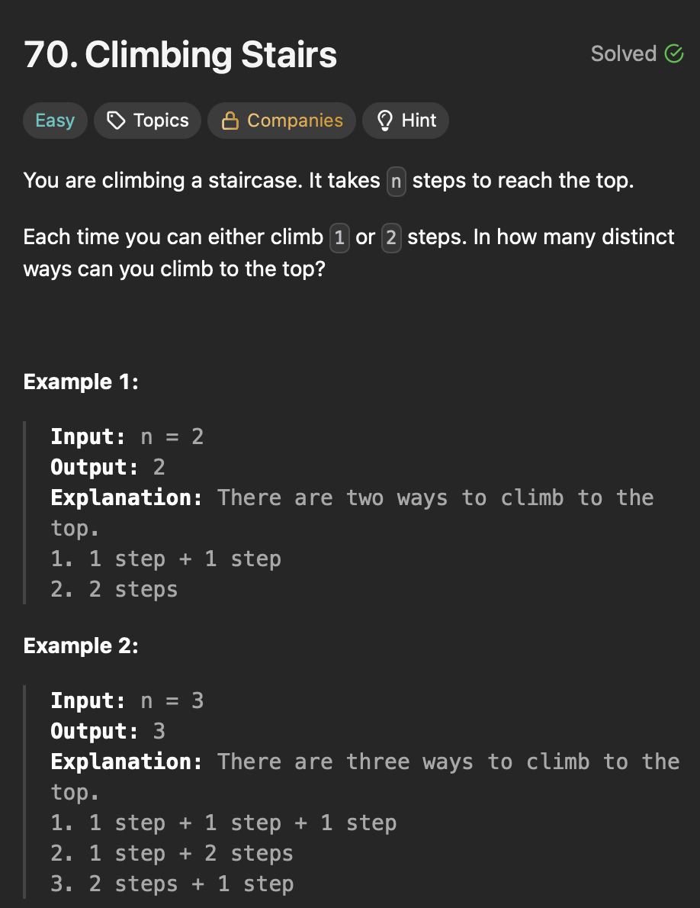

# **1D Dynamic Programming**
## **Theory**
### Tabulation
- Bottoms up Dynamic Programming 
### Memoization
- Top down Dynamic Programming
- We tend to store the value of sub problems in some map/table.

## **Climbing Stairs**
<div align="center">
  
</div>

#### Brute - Recursion 
```java
public class ClimbingStairs {
  public static void main(String[] args) {
    int n = 2;
    int result = climbStairsBrute(n);
    System.out.println(result);
  }

  private static int climbStairsBrute(int n) {
    if (n == 0)
      return 1;
    if (n < 0)
      return 0;

    return climbStairsBrute(n-1)+climbStairsBrute(n-2);
  }

}
```
>Time Complexity - O(2<sup>n</sup>) 
- Each call to `climbStairsBrute(n)` makes two recursive calls.
    - One for `n-1`.
    - One for `n-2`.
- Number of nodes (function calls) in this recursion tree is approximately 2<sup>n</sup> because each call branches into two more calls, except at base cases.
- Hence, the total number of recursive calls grows exponentially with n.
- Time complexity is exponential due to repeated calculations.
>Space Complexity - O(n)
- Recursion stack

#### Explanation

- Base cases
    - If `n == 0`: You are already at the bottom (start), so there is exactly 1 way to stand still (do nothing).
    - If `n < 0`: You have stepped beyond the bottom (invalid path), so there are 0 ways.
- Recursive step
    - For any `n > 0`, calculate:
        - `ways(n) = ways(n-1) + ways(n-2)`
        - Example: If `n` is 2, then `ways(2) = ways(1) + ways(0)` which is 1+1 = 2.
#### Steps

-

#### Optimal - Dynamic Programming(Bottoms up)
```java
public class ClimbingStairs {
  public static void main(String[] args) {
    int n = 2;
    int result = climbStairsOptimal(n);
    System.out.println(result);
  }

  private static int climbStairsOptimal(int n) {
    if (n <= 1)
      return 1;

    int[] dp = new int[n + 1];
    dp[0] = 1;
    dp[1] = 1;

    for (int i = 2; i <= n; i++) {
      dp[i] = dp[i - 1] + dp[i - 2];
    }

    return dp[n];
  }
}
```

>Time Complexity - O(n)
- single loop from 2 to n.

>Space Complexity - O(1)


#### Explanation
- If n is 4.

| Step(i)      | dp[i] calculations     | dp[i] value      |
| :---:  | :----:  |:---:           |
| 0 | Base case | 1 |
| 1 | Base case | 1 |
| 2 | dp[1]+dp[2] = 1+1 | 2 |
| 3 | dp[2]+dp[1] = 2+1 | 3 |
| 4 | dp[3]+dp[2] = 3+2 | 5 |

- Hence, there are 5 distinct ways to reach step 4.  
#### Steps

-

## **House Robbers**

<div align="center">
  
</div>

#### Brute - Recursion 
```java
public class HouseRobber {

  public static void main(String[] args) {
    int[] nums = { 1, 2, 3, 1 };
    System.out.println(robBrute(nums)); // Output: 4(3+1)
  }

  private static int robBrute(int[] nums) {
    return recursionBrute(nums, 0);
  }

  private static int recursionBrute(int[] nums, int index) {
    // Base case: no houses left
    if (index >= nums.length)
      return 0;

    // Rob current house and move to house index+2
    int robCurrent = nums[index] + recursionBrute(nums, index + 2);

    // Skip current house and move to house index+1
    int skipCurrent = recursionBrute(nums, index + 1);

    return Math.max(robCurrent, skipCurrent);
  }
}
```

>Time Complexity - O(2<sup>n</sup>) 
- Exponential number of recursive calls.

>Space Complexity - O(n)
- Recursion stack

#### Explanation


#### Steps

-

#### Optimal - Dynamic Programming 
```java
public class HouseRobber {

  public static void main(String[] args) {
    int[] nums = { 2, 1 };
    System.out.println(robOptimal(nums)); // Output: 4(3+1)
  }

  private static int robOptimal(int[] nums) {
    if (nums.length == 0)
      return 0;
    if (nums.length == 1)
      return nums[0];

    int[] dp = new int[nums.length];
    dp[0] = nums[0];
    dp[1] = Math.max(nums[0], nums[1]);

    for (int i = 2; i < nums.length; i++) {
      dp[i] = Math.max(dp[i - 1], dp[i - 2] + nums[i]);
    }
    return dp[nums.length - 1];
  }
}
```

>Time Complexity - O(n)

>Space Complexity - O(n)
#### Explanation

- This is the formula
    - `dp[i] = max(dp[i-1], dp[i-2]+nums[i])`
- Here `dp[i]` is the maximum amount of money you can rob from house 0 to house `i` (may or may not include money from house `i`).
- Rob house `i` - `dp[i-2]+nums[i]`
    - if you rob house `i` you cannot rob house `i-1`.
    - So you rob house `i` which is `nums[i]` and the add it to the maximum you could rob up to house`[i-2]`.
- Skip house `i`
    - If skip house `i`, then your max loot is the whatever you had until `i-1`.

#### Steps

-

## **House Robbers II**

<div align="center">
  
</div>

#### Brute - 
```java
public class HouseRobberII {

  public static void main(String[] args) {
    int[] nums = { 1, 2, 3, 1 };
    int maxLoot = houseRobberBrute(nums);
    System.out.println(maxLoot);
  }

  private static int houseRobberBrute(int[] nums) {
    if (nums.length == 1)
      return nums[0];
    if (nums.length == 0)
      return 0;

    int excludeLast = robBrute(nums, 0, nums.length - 2);
    int excludeFirst = robBrute(nums, 1, nums.length - 1);

    return Math.max(excludeFirst, excludeLast);
  }

  private static int robBrute(int[] nums, int start, int end) {
    if (start > end) {
      return 0;
    }

    int robCurrent = nums[start] + robBrute(nums, start + 2, end);
    int skipCurrent = robBrute(nums, start + 1, end);

    return Math.max(robCurrent, skipCurrent);
  }
}
```

>Time Complexity - O(2<sup>n</sup>) 
- Exponential.

>Space Complexity - O(n)
- Recursion stack.

#### Explanation

-

#### Steps

-

#### Optimal - Dynamic Programming 
```java
public class HouseRobberII {

  public static void main(String[] args) {
    int[] nums = { 1, 2, 3, 1 };
    int maxLoot = houseRobberBrute(nums);
    System.out.println(maxLoot);
  }

  private static int houseRobberOptimal(int[] nums) {
    if (nums.length == 1)
      return nums[0];

    int[] excludeLast = new int[nums.length - 1];
    int[] excludeFirst = new int[nums.length - 1];

    for (int i = 0; i < nums.length - 1; i++) {
      excludeLast[i] = nums[i];
      excludeFirst[i] = nums[i + 1];
    }

    int loot1 = robOptimal(excludeLast);
    int loot2 = robOptimal(excludeFirst);

    return Math.max(loot1, loot2);
  }

  private static int robOptimal(int[] nums) {
    if (nums.length == 1)
      return nums[0];

    int[] dp = new int[nums.length];
    dp[0] = nums[0];
    dp[1] = Math.max(nums[0], nums[1]);

    for (int i = 2; i < nums.length; i++) {
      dp[i] = Math.max(dp[i - 1], dp[i - 2] + nums[i]);
    }
    return dp[nums.length - 1];
  }
}
```

>Time Complexity - O(n) 

>Space Complexity - O(n)
#### Explanation

-

#### Steps

-
## **Longest Palindromic Substring**

<div align="center">
  
</div>

#### Brute - 
```java
public class LongestPalindromicSubstring {

  public static void main(String[] args) {
    String s = "babad";
    System.out.println(longestPalindromicSubstringOptimal(s)); // Output: "bab" or "aba"
  }

  private static String longestPalindromicSubstringBrute(String s) {
    if (s == null || s.length() < 1)
      return "";

    int maxLength = 1;
    int start = 0;

    for (int i = 0; i < s.length(); i++) {
      for (int j = i; j < s.length(); j++) {
        if (isPalindromeBrute(s, i, j) && maxLength < (j - i + 1)) {
          start = i;
          maxLength = j - i + 1;
        }
      }
    }
    return s.substring(start, start + maxLength);
  }

  private static boolean isPalindromeBrute(String s, int left, int right) {
    while (left < right) {
      if (s.charAt(left) != s.charAt(right))
        return false;
      left++;
      right--;
    }
    return true;
  }
}
```

>Time Complexity - O(n<sup>3</sup>)

>Space Complexity - O(1) 
#### Explanation

-

#### Steps

-

#### Optimal -
```java
public class LongestPalindromicSubstring {

  public static void main(String[] args) {
    String s = "babad";
    System.out.println(longestPalindromicSubstringOptimal(s)); // Output: "bab" or "aba"
  }

  private static String longestPalindromicSubstringOptimal(String s) {
    int n = s.length();
    if (n < 2)
      return s;

    boolean[][] dp = new boolean[n][n];

    int maxLen = 1;
    int start = 0;
    // Step 1: Every single character is a palindrome by itself
    for (int i = 0; i < n; i++) {
      dp[i][i] = true;
    }

    // Step 2: Check for palindrome substrings of length 2
    for (int i = 0; i < n - 1; i++) {
      if (s.charAt(i) == s.charAt(i + 1)) {
        dp[i][i + 1] = true;
        start = i;
        maxLen = 2;
      }
    }
    // Step 3: Check for palindromes longer than length 2
    // length varies from 3 to n
    for (int length = 3; length <= n; length++) {
      for (int i = 0; i <= n - length; i++) {
        int j = i + length - 1;
        if (s.charAt(i) == s.charAt(j) && dp[i + 1][j - 1]) {
          dp[i][j] = true;
          if (length > maxLen) {
            start = i;
            maxLen = length;
          }
        }
      }

    }
    return s.substring(start, start + maxLen);
  }
}
```

>Time Complexity - O(n<sup>2</sup>) 
- Double nested loops.

>Space Complexity - O(n<sup>2</sup>) 
- DP table size is n x n. 

#### Explanation

-

#### Steps

-

## **Palindromic Substring**

<div align="center">
  
</div>

#### Brute - 
```java

public class PalindromicSubstrings {

  public static void main(String[] args) {
    // String str = "aaa";
    String str = "abc";
    System.out.println(palindromicSubstringOptimal(str));
  }

  private static int palindromicSubstringBrute(String str) {
    int count = 0;
    for (int i = 0; i < str.length(); i++) {
      for (int j = i; j < str.length(); j++) {
        if (isPalindromeBrute(str, i, j)) {
          count++;
        }
      }
    }
    return count;
  }

  private static boolean isPalindromeBrute(String str, int start, int end) {
    while (start < end) {
      if (str.charAt(start) != str.charAt(end))
        return false;
      start++;
      end--;
    }
    return true;
  }
}
```

>Time Complexity - O(n<sup>3</sup>) 
- O(n<sup>2</sup>) - for generating all substrings.
- O(n) - for palindrome check.
>Space Complexity - O(1)
#### Explanation

-

#### Steps

-

#### Optimal - Dynamic Programming
```java

public class PalindromicSubstrings {

  public static void main(String[] args) {
    // String str = "aaa";
    String str = "abc";
    System.out.println(palindromicSubstringOptimal(str));
  }

  private static int palindromicSubstringOptimal(String str) {
    int n = str.length();
    int count = 0;
    boolean[][] dp = new boolean[n][n];

    for (int i = 0; i < n; i++) {
      dp[i][i] = true;
      count++;
    }

    for (int i = 0; i < n - 1; i++) {
      if (str.charAt(i) == str.charAt(i + 1)) {
        dp[i][i + 1] = true;
        count++;
      }
    }

    for (int length = 3; length <= n; length++) {
      for (int i = 0; i <= n - length; i++) {
        int j = i + length - 1;

        if (str.charAt(i) == str.charAt(j) && dp[i + 1][j - 1]) {
          dp[i][j] = true;
          count++;
        }
      }
    }
    return count;
  }
}
```
>Time Complexity - O(n<sup>2</sup>) 
- Two nested loops to fill the DP table.
>Space Complexity - O(n<sup>2</sup>) 
- DP table space
#### Explanation

-

#### Steps

-

## **Decode Ways**

<div align="center">
  
</div>

#### Brute - 
```java
public class DecodeWays {

  public static void main(String[] args) {
    String s = "226";
    System.out.println(decodeOptimal(s)); // Output: 3
  }

  private static int decodeBrute(String s) {
    return decodeBrute(s, 0);
  }

  private static int decodeBrute(String s, int index) {
    if (index == s.length()) {
      return 1;
    }
    // If string starts with '0', no valid decoding
    if (s.charAt(index) == '0') {
      return 0;
    }
    // Decode one digit
    int ways = decodeBrute(s, index + 1);
    // Decode two digit
    if (index + 1 < s.length()) {
      int twoDigit = Integer.parseInt(s.substring(index, index + 2));
      if (twoDigit >= 10 && twoDigit <= 26) {
        ways += decodeBrute(s, index + 2);
      }
    }
    return ways;
  }
}
```

>Time Complexity - O(2<sup>n</sup>) 
- Exponential
>Space Complexity - O(n)
#### Explanation

-

#### Steps

-

#### Optimal - Dynamic Programming
```java
public class DecodeWays {

  public static void main(String[] args) {
    String s = "226";
    System.out.println(decodeOptimal(s)); // Output: 3
  }

  private static int decodeOptimal(String s) {
    if (s == null || s.length() == 0) {
      return 0;
    }

    int n = s.length();
    int[] dp = new int[n + 1];
    dp[0] = 1;
    if (s.charAt(0) != '0') {
      dp[1] = 1;
    } else {
      dp[1] = 0;
    }

    for (int i = 2; i <= n; i++) {
      int oneDigit = Integer.parseInt(s.substring(i - 1, i));
      if (oneDigit >= 1 && oneDigit <= 9) {
        // dp[i] is always initially 0, but its added each time to maintain consistency
        // in case order changes or new checks are introduced
        dp[i] = dp[i] + dp[i - 1];
      }

      int twoDigit = Integer.parseInt(s.substring(i - 2, i));
      if (twoDigit >= 10 && twoDigit <= 26) {
        dp[i] = dp[i] + dp[i - 2];
      }
    }
    return dp[n];
  }
}
```
>Time Complexity - O(n)
>Space Complexity - O(n)
#### Explanation

-

#### Steps

-

## **Coin Change**
>
#### Brute - 
>Time Complexity - 

>Space Complexity - 
```java

```
#### Explanation

-

#### Steps

-

#### Optimal -
>Time Complexity - 

>Space Complexity - 

```java
public class CoinChange {
    public static void main(String[] args) {
        int[] coins = { 1, 5, 6, 9 };
        int amount = 11;
        System.out.println(coinChange(coins, amount));
    }

    private static int coinChange(int[] coins, int amount) {
        if (amount < 1)
            return 0;

        int[] minCoinsDp = new int[amount + 1];

        for (int i = 1; i <= amount; i++) {
            minCoinsDp[i] = Integer.MAX_VALUE;
            for (int coin : coins) {
                // helps us avoid invalid updates to minCoinsDp[i]. Without it, we might
                // incorrectly assume an unreachable amount is reachable, leading to incorrect
                // results.
                if (coin <= i && minCoinsDp[i - coin] != Integer.MAX_VALUE) {
                    minCoinsDp[i] = Math.min(minCoinsDp[i], 1 + minCoinsDp[i - coin]);
                }
            }
        }
        if (minCoinsDp[amount] == Integer.MAX_VALUE)
            return -1;

        return minCoinsDp[amount];
    }
}
```
#### Explanation

-

#### Steps

-

## **Maximum Product Sub-array**
>
#### Brute - 
>Time Complexity - 

>Space Complexity - 
```java

```
#### Explanation

-

#### Steps

-

#### Optimal -
>Time Complexity - O(n)

>Space Complexity - O(1)

```java
public class MaximumProductSubarray {
    public static void main(String[] args) {
        int[] nums = { 2, 3, -2, -5, 6, -1, 4 };
        System.out.println(maximumProductSubarray(nums));
    }

    private static int maximumProductSubarray(int[] nums) {
        int leftProduct = 1;
        int rightProduct = 1;
        int ans = nums[0];

        for (int i = 1; i < nums.length; i++) {
            leftProduct = leftProduct == 0 ? 1 : leftProduct;
            leftProduct *= nums[i];
            rightProduct = rightProduct == 0 ? 1 : rightProduct;
            rightProduct *= nums[nums.length - 1 - i];

            ans = Math.max(ans, Math.max(leftProduct, rightProduct));
        }
        return ans;
    }
}
```
#### Explanation

- Kadane's algorithm

#### Steps

-
