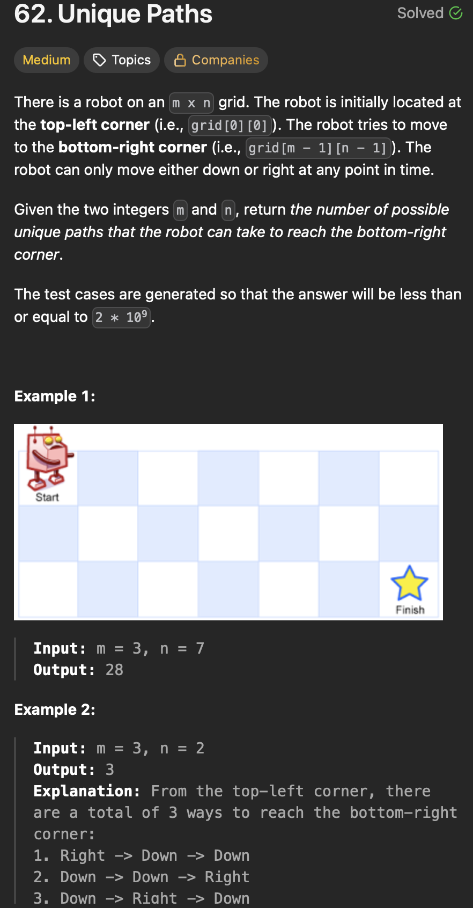
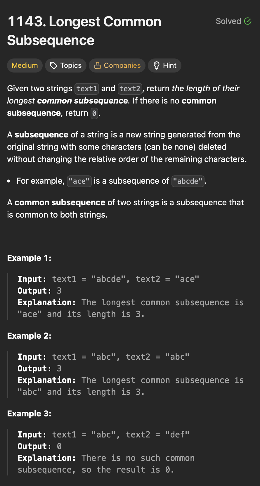

# **2D Dynamic Programming**
## **Theory**
### Tabulation
- Bottoms up Dynamic Programming 
### Memoization
- Top down Dynamic Programming
- We tend to store the value of sub problems in some map/table.

## **Unique Paths**
<div align="center">
  
</div>

#### Brute - Recursion 
```java

public class UniquePaths {

  public static void main(String[] args) {
    int m = 3, n = 7;
    int result = uniquePathsOptimal(m, n);
    System.out.println("Number of unique paths in a " + m + "x" + n + " grid: " + result);
  }

  private static int uniquePathsBrute(int m, int n) {
    return countPath(0, 0, m, n);
  }

  private static int countPath(int row, int col, int m, int n) {
    if (row >= m || col >= n)
      return 0;

    if (row == m - 1 && col == n - 1)
      return 1;

    int pathDown = countPath(row + 1, col, m, n);
    int pathRight = countPath(row, col + 1, m, n);

    return pathDown + pathRight;
  }
}
```
>Time Complexity - O(2<sup>m+n</sup>) 
- At each step there are 2 choices and recursion grows exponentially.

>Space Complexity - O(m + n)
- Recursion stack.
#### Explanation
#### Steps

-

#### Optimal - Dynamic Programming(Bottoms up)
```java
public class UniquePaths {

  public static void main(String[] args) {
    int m = 3, n = 7;
    int result = uniquePathsOptimal(m, n);
    System.out.println("Number of unique paths in a " + m + "x" + n + " grid: " + result);
  }

  private static int uniquePathsOptimal(int m, int n) {
    int[][] dp = new int[m][n];
    // Initialize first row to 1
    for (int j = 0; j < n; j++) {
      dp[0][j] = 1;
    }
    // Initialize first col to 1
    for (int i = 0; i < m; i++) {
      dp[i][0] = 1;
    }

    // Fill dp table
    for (int i = 1; i < m; i++) {
      for (int j = 1; j < n; j++) {
        // Number of paths to (i,j) is sum of paths from top and left
        dp[i][j] = dp[i - 1][j] + dp[i][j - 1];
      }
    }
    // Return bottom right corner
    return dp[m - 1][n - 1];
  }

```

>Time Complexity - O(m x n)
- To fill the dp table.

>Space Complexity - O(m x n)
- Space used by dp table.

#### Explanation
#### Steps

-


## **Longest Common Subsequence**
<div align="center">
  
</div>

#### Brute - Recursion 
```java
public class LongestCommonSubsequence {

  public static void main(String[] args) {
    String text1 = "abcde";
    String text2 = "ace";
    int result = longestCommonSubsequenceOptimal(text1, text2);
    System.out.println("Length of Longest Common Subsequence: " + result);
  }

  private static int longestCommonSubsequenceBrute(String text1, String text2) {
    return helperBrute(text1, text2, 0, 0);
  }

  private static int helperBrute(String text1, String text2, int i, int j) {
    // If either string is fully traversed, no more subsequence
    if (i == text1.length() || j == text2.length())
      return 0;
    // If characters match, add 1 and move both pointers
    if (text1.charAt(i) == text2.charAt(j)) {
      return 1 + helperBrute(text1, text2, i + 1, j + 1);
    } else {
      // Else, try skipping one character from either string and take max
      return Math.max(helperBrute(text1, text2, i + 1, j), helperBrute(text1, text2, i, j + 1));
    }
  }
}
```
>Time Complexity - O(2<sup>m+n</sup>) 
- At each step there are 2 choices and recursion grows exponentially.

>Space Complexity - O(m + n)
- Recursion stack.
#### Explanation
#### Steps

-

#### Optimal - Dynamic Programming(Bottoms up)
```java
public class LongestCommonSubsequence {

  public static void main(String[] args) {
    String text1 = "abcde";
    String text2 = "ace";
    int result = longestCommonSubsequenceOptimal(text1, text2);
    System.out.println("Length of Longest Common Subsequence: " + result);
  }

  private static int longestCommonSubsequenceOptimal(String text1, String text2) {
    int m = text1.length();
    int n = text2.length();

    int[][] dp = new int[m + 1][n + 1];

    for (int i = 1; i <= m; i++) {
      for (int j = 1; j <= n; j++) {
        if (text1.charAt(i - 1) == text2.charAt(j - 1)) {
          dp[i][j] = dp[i - 1][j - 1] + 1;
        } else {
          dp[i][j] = Math.max(dp[i - 1][j], dp[i][j - 1]);
        }
      }
    }
    return dp[m][n];
  }
}
```

>Time Complexity - O(m x n)
- To fill the dp table.

>Space Complexity - O(m x n)
- Space used by dp table.

#### Explanation
#### Steps

-

