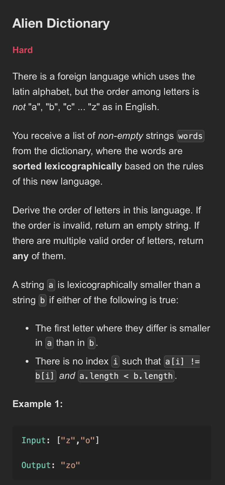
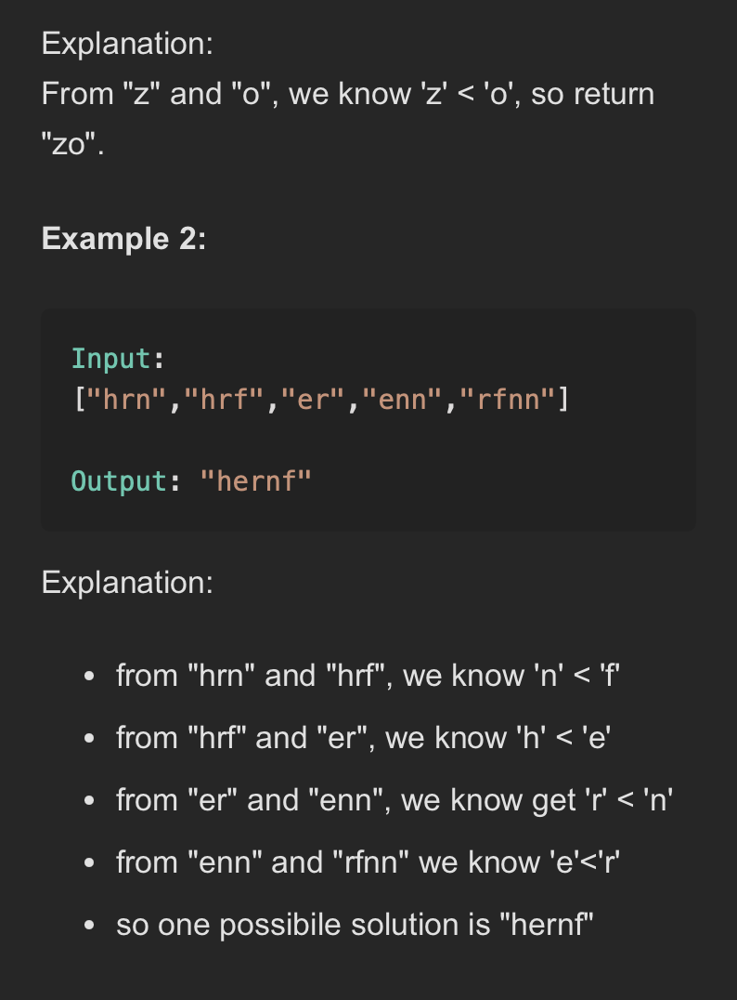

# **Advanced Graphs**
## **Alien Dictionary**
<div align="center">
  
</div>
<div align="center">
  
</div>


#### Optimal -

```java
 public class AlienDictionary {

   public static void main(String[] args) {
     String[] words = { "wrt", "wrf", "er", "ett", "rftt" };
     System.out.println(alienDictionaryOrderBFS(words)); // Output: "wertf"
   }

   private static String alienDictionaryOrderBFS(String[] words) {
     // Step 1: Initialize graph and in-degree map
     Map<Character, Set<Character>> graph = new HashMap<>();
     Map<Character, Integer> inDegree = new HashMap<>();

     // Initialize nodes for all unique characters with in-degree 0
     for (String word : words) {
       for (char c : word.toCharArray()) {
         graph.putIfAbsent(c, new HashSet<>());
         inDegree.putIfAbsent(c, 0);
       }
     }

     // Step 2: Build graph edges from adjacent words
     for (int i = 0; i < words.length - 1; i++) {
       String first = words[i];
       String second = words[i + 1];
       int length = Math.min(first.length(), second.length());
       boolean foundOrder = false;

       for (int j = 0; j < length; j++) {
         char out = first.charAt(j);
         char in = second.charAt(j);

         if (out != in) {
           if (!graph.get(out).contains(in)) {
             graph.get(out).add(in);
             inDegree.put(in, inDegree.get(in) + 1);
           }
           foundOrder = true;
           break;
         }
       }
       // Check for invalid input like prefix case ("abc", "ab")
       if (!foundOrder && first.length() > second.length()) {
         return "";
       }
     }

     // Step 3: BFS for topological sort
     Queue<Character> queue = new LinkedList<>();

     // Start with characters with in-degree 0 (no dependencies)
     for (char c : inDegree.keySet()) {
       if (inDegree.get(c) == 0) {
         queue.offer(c);
       }
     }

     StringBuilder sb = new StringBuilder();

     while (!queue.isEmpty()) {
       char current = queue.poll();
       sb.append(current);

       // Decrement in-degree for all neighbors
       for (char neighbor : graph.get(current)) {
         inDegree.put(neighbor, inDegree.get(neighbor) - 1);
         if (inDegree.get(neighbor) == 0) {
           queue.offer(neighbor);
         }
       }
     }

     // If result length != number of unique chars, cycle exists → return ""
     if (sb.length() != inDegree.size()) {
       return "";
     }

     return sb.toString();
   }
 }
 
```
>Time Complexity - O(C + W x L) 
- C is number of unique characters in all words.
- W is number of words.
- L is average length of each word.
>Space Complexity - O(C + W x L) 

#### Explanation

-

#### Steps

-

#### Follow up 

-


