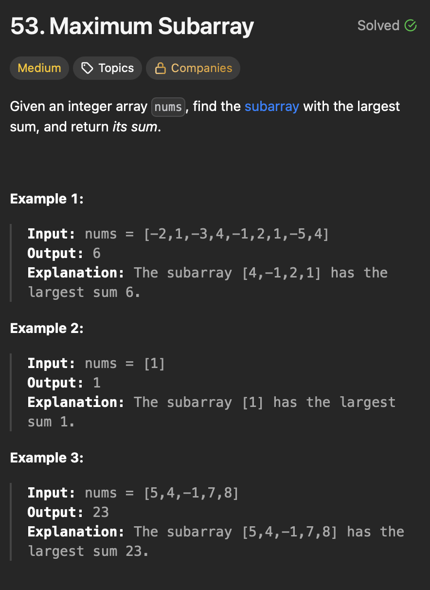

# **Greedy**

## **Maximum Subarray**
<div align="center">
  
</div>

#### Brute 
```java

public class MaximumSubarray {
  public static void main(String[] args) {
    int[] nums = { -2, 1, -3, 4, -1, 2, 1, -5, 4 };
    int result = maxSubArrayOptimal(nums);
    System.out.println("Maximum Subarray Sum is: " + result);
  }

  private static int maxSubArrayOptimal(int[] nums) {
    int maxSum = nums[0];
    int currentSum = 0;

    for (int n : nums) {
      currentSum += n;

      maxSum = Math.max(maxSum, currentSum);

      if (currentSum < 0)
        currentSum = 0;

    }
    return maxSum;
  }

  private static int maxSubArrayBrute(int[] nums) {
    int maxSum = Integer.MIN_VALUE;
    for (int i = 0; i < nums.length; i++) {
      int currentSum = 0;
      for (int j = i; j < nums.length; j++) {
        currentSum += nums[j];
        maxSum = Math.max(currentSum, maxSum);
      }
    }
    return maxSum;
  }
}
```
>Time Complexity - O(n<sup>2</sup>)

>Space Complexity - O(n)

#### Explanation

#### Steps

-

#### Optimal - 
```java
public class MaximumSubarray {
  public static void main(String[] args) {
    int[] nums = { -2, 1, -3, 4, -1, 2, 1, -5, 4 };
    int result = maxSubArrayOptimal(nums);
    System.out.println("Maximum Subarray Sum is: " + result);
  }

  private static int maxSubArrayOptimal(int[] nums) {
    int maxSum = nums[0];
    int currentSum = 0;

    for (int n : nums) {
      currentSum += n;

      maxSum = Math.max(maxSum, currentSum);

      if (currentSum < 0)
        currentSum = 0;

    }
    return maxSum;
  }
}
```

>Time Complexity - O(n)
- Single pass.
>Space Complexity - O(1)
- Constant Space
#### Explanation
#### Steps

-


