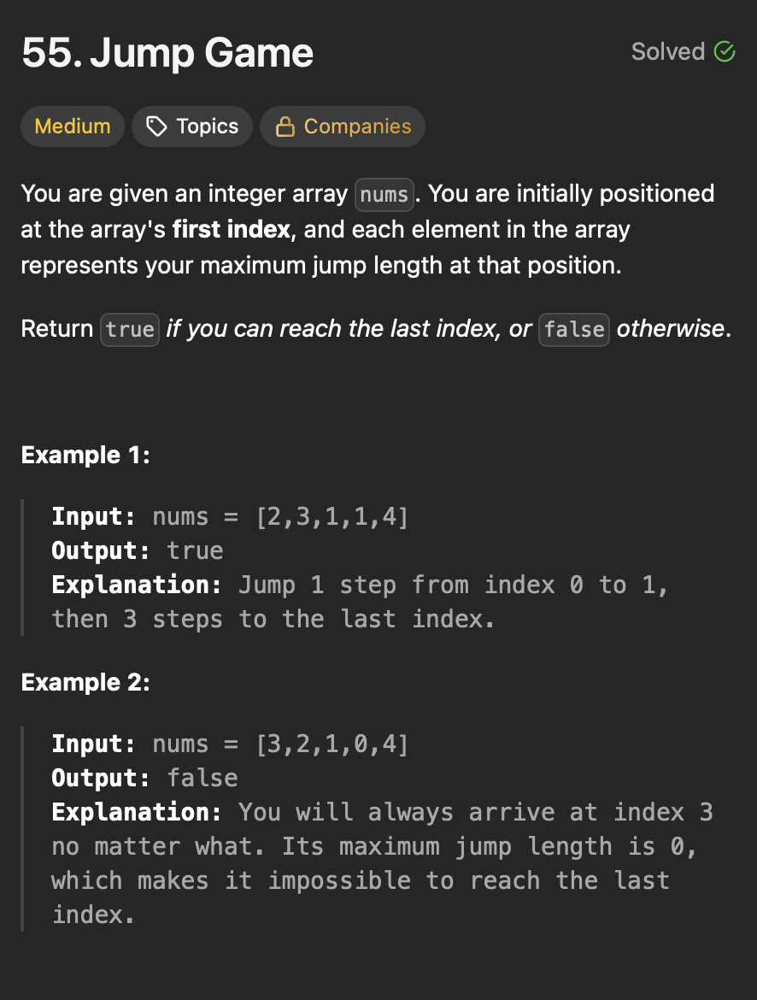

# **Greedy**

## **Maximum Subarray**
<div align="center">
  
</div>

#### Brute 

```java
public class MaximumSubarray {
  public static void main(String[] args) {
    int[] nums = { -2, 1, -3, 4, -1, 2, 1, -5, 4 };
    int result = maxSubArrayOptimal(nums);
    System.out.println("Maximum Subarray Sum is: " + result);
  }

  private static int maxSubArrayBrute(int[] nums) {
    int maxSum = Integer.MIN_VALUE;
    for (int i = 0; i < nums.length; i++) {
      int currentSum = 0;
      for (int j = i; j < nums.length; j++) {
        currentSum += nums[j];
        maxSum = Math.max(currentSum, maxSum);
      }
    }
    return maxSum;
  }
}

```
>Time Complexity - O(n<sup>2</sup>)

>Space Complexity - O(n)

#### Explanation

#### Steps

-

#### Optimal - 
```java
public class MaximumSubarray {
  public static void main(String[] args) {
    int[] nums = { -2, 1, -3, 4, -1, 2, 1, -5, 4 };
    int result = maxSubArrayOptimal(nums);
    System.out.println("Maximum Subarray Sum is: " + result);
  }

  private static int maxSubArrayOptimal(int[] nums) {
    int maxSum = nums[0];
    int currentSum = 0;

    for (int n : nums) {
      currentSum += n;

      maxSum = Math.max(maxSum, currentSum);

      if (currentSum < 0)
        currentSum = 0;

    }
    return maxSum;
  }
}
```

>Time Complexity - O(n)
- Single pass.
>Space Complexity - O(1)
- Constant Space
#### Explanation
#### Steps

-


## **Jump Game**
<div align="center">
  
</div>

#### Brute 
```java
public class JumpGame {
  public static void main(String[] args) {
    int[] nums = { 2, 3, 1, 1, 4 };
    System.out.println("Can jump to last index? " + jumpGameOptimal(nums));
  }

  private static boolean jumpGameBrute(int[] nums) {
    return jumpBrute(0, nums);
  }

  private static boolean jumpBrute(int position, int[] nums) {
    if (position == nums.length - 1) {
      return true;
    }
    int furthestJump = Math.min(position + nums[position], nums.length - 1);
    for (int nextPosition = position + 1; nextPosition <= furthestJump; nextPosition++) {
      if (jumpBrute(nextPosition, nums)) {
        return true;
      }
    }
    return false;
  }
}
```
>Time Complexity - O(2<sup>n</sup>)

>Space Complexity - O(n)

#### Explanation

#### Steps

-

#### Optimal - 
```java
public class JumpGame {
  public static void main(String[] args) {
    int[] nums = { 2, 3, 1, 1, 4 };
    System.out.println("Can jump to last index? " + jumpGameOptimal(nums));
  }

  private static boolean jumpGameOptimal(int[] nums) {
    int furthestReach = 0;
    for (int i = 0; i < nums.length; i++) {
      if (i > furthestReach) {
        return false;
      }
      furthestReach = Math.max(furthestReach, i + nums[i]);
      if (furthestReach >= nums.length - 1) {
        return true;
      }
    }
    return false;
  }
}
```

>Time Complexity - O(n)
- Single pass.
>Space Complexity - O(1)
- Constant Space
#### Explanation
#### Steps

-


