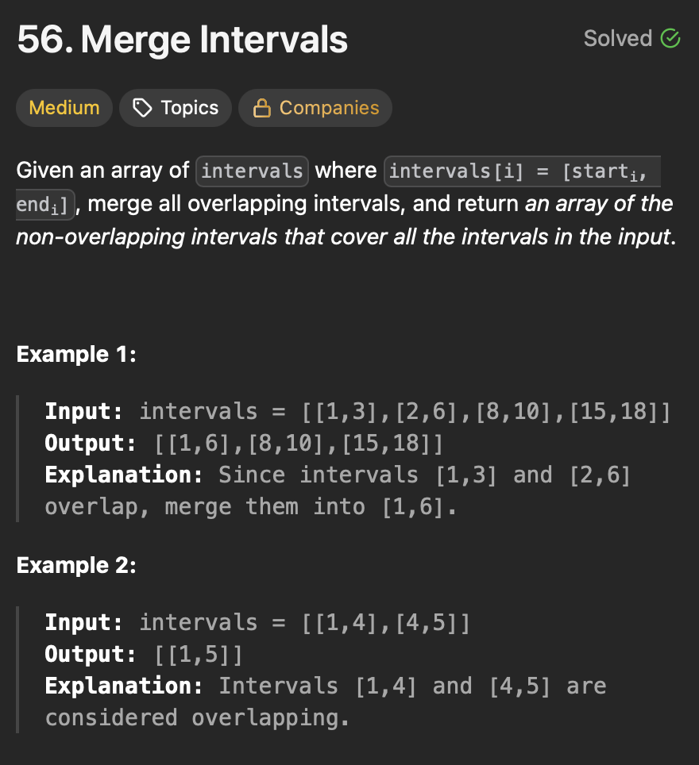

# **Intervals**

## **Insert Interval**
<div align="center">
  
</div>

#### Optimal - Greedy 

```java

public class InsertInterval {

  public static void main(String[] args) {
    int[][] intervals = { { 1, 3 }, { 6, 9 } };
    int[] newInterval = { 2, 5 };

    int[][] result = insertInterval(intervals, newInterval);

    System.out.println("Updated intervals:");
    for (int[] interval : result) {
      System.out.println(Arrays.toString(interval));
    }
  }

  private static int[][] insertInterval(int[][] intervals, int[] newInterval) {
    List<int[]> result = new ArrayList<>();

    int i = 0;
    int n = intervals.length;

    // Add all intervals before newInterval
    while (i < n && intervals[i][1] < newInterval[0]) {
      result.add(intervals[i]);
      i++;
    }

    // Merge all overlapping intervals with newInterval
    while (i < n && intervals[i][0] <= newInterval[1]) {
      newInterval[0] = Math.min(newInterval[0], intervals[i][0]);
      newInterval[1] = Math.max(newInterval[1], intervals[i][1]);
      i++;
    }
    result.add(newInterval);

    // Add remaining intervals after newInterval
    while (i < n) {
      result.add(intervals[i]);
      i++;
    }
    // Convert list to array
    return result.toArray(new int[result.size()][]);
  }

}
```
>Time Complexity - O(n)
- We iterate over the intervals once.

>Space Complexity - O(n)
- List size.

#### Explanation

#### Steps

-


## **Merge Intervals**
<div align="center">
  
</div>

#### Optimal - Greedy 

```java
public class MergeIntervals {

  public static void main(String[] args) {
    // int[][] intervals = { { 1, 3 }, { 2, 6 }, { 8, 10 }, { 15, 18 } };
    int[][] intervals = { { 1, 4 }, { 0, 4 } };
    int[][] result = merge(intervals);

    System.out.println("Merged intervals:");
    for (int[] interval : result) {
      System.out.println(Arrays.toString(interval));
    }
  }

  private static int[][] merge(int[][] intervals) {
    if (intervals.length == 0)
      return new int[0][];

    // Sort intervals by start time in ascending order
    Arrays.sort(intervals, (a, b) -> Integer.compare(a[0], b[0]));

    List<int[]> merged = new ArrayList<>();
    merged.add(intervals[0]);

    for (int i = 1; i < intervals.length; i++) {
      int[] last = merged.get(merged.size() - 1);
      int[] current = intervals[i];

      if (current[0] <= last[1]) {
        // overlap detected, merge the intervals 
        last[1] = Math.max(last[1], current[1]);
      } else {
        // no overlap, add the current interval to the merged list
        merged.add(current);
      }
    }
    return merged.toArray(new int[merged.size()][]);
  }
}
```
>Time Complexity - O(n log n)
- We iterate over the intervals once.

>Space Complexity - O(n)
- List size.

#### Explanation

#### Steps

-


