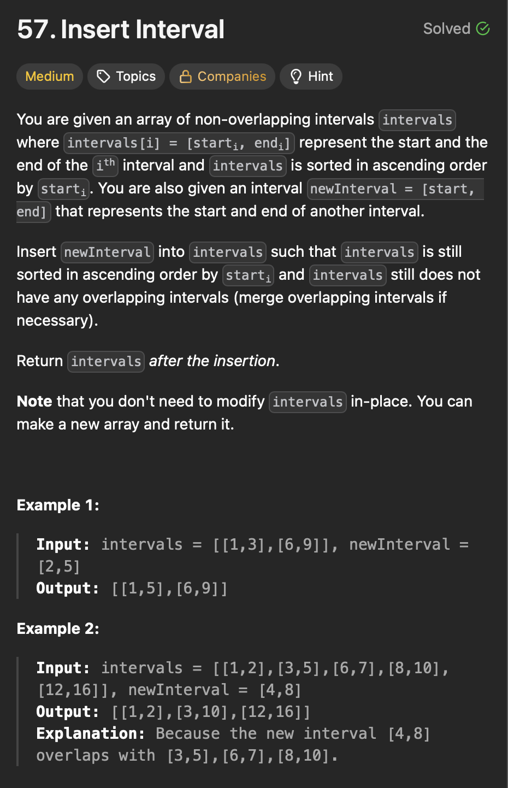

# **Intervals**

## **Insert Interval**
<div align="center">
  
</div>

#### Optimal - Greedy 

```java

public class InsertInterval {

  public static void main(String[] args) {
    int[][] intervals = { { 1, 3 }, { 6, 9 } };
    int[] newInterval = { 2, 5 };

    int[][] result = insertInterval(intervals, newInterval);

    System.out.println("Updated intervals:");
    for (int[] interval : result) {
      System.out.println(Arrays.toString(interval));
    }
  }

  private static int[][] insertInterval(int[][] intervals, int[] newInterval) {
    List<int[]> result = new ArrayList<>();

    int i = 0;
    int n = intervals.length;

    // Add all intervals before newInterval
    while (i < n && intervals[i][1] < newInterval[0]) {
      result.add(intervals[i]);
      i++;
    }

    // Merge all overlapping intervals with newInterval
    while (i < n && intervals[i][0] <= newInterval[1]) {
      newInterval[0] = Math.min(newInterval[0], intervals[i][0]);
      newInterval[1] = Math.max(newInterval[1], intervals[i][1]);
      i++;
    }
    result.add(newInterval);

    // Add remaining intervals after newInterval
    while (i < n) {
      result.add(intervals[i]);
      i++;
    }
    // Convert list to array
    return result.toArray(new int[result.size()][]);
  }

}
```
>Time Complexity - O(n)
- We iterate over the intervals once.

>Space Complexity - O(n)
- List size.

#### Explanation

#### Steps

-


