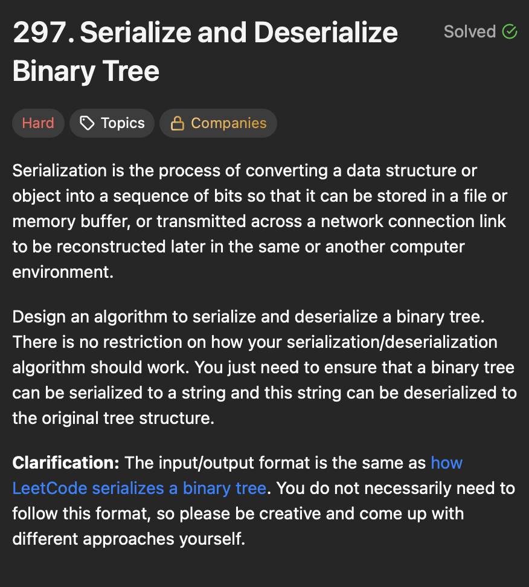

# **Binary Tree**
## **Binary Tree Implementation**
```java
class TreeNode {
    int val;
    TreeNode left;
    TreeNode right;

    TreeNode(int val) {
        this.val = val;
    }

    TreeNode(int val, TreeNode left, TreeNode right) {
        this.val = val;
        this.left = left;
        this.right = right;
    }
}

public class BinaryTree {
    public static void main(String[] args) {
        TreeNode root = new TreeNode(1);
        root.left = new TreeNode(2);
        root.right = new TreeNode(3);
        root.right.left = new TreeNode(4);
    }

    public static void printTree(TreeNode root, int space) {
        // Base case
        if (root == null)
            return;

        // Increase distance between levels
        space += 5;

        // Print right child first
        printTree(root.right, space);

        // Print current node after space count
        System.out.println();
        for (int i = 5; i < space; i++) {
            System.out.print(" ");
        }
        System.out.println(root.val);

        // Print left child
        printTree(root.left, space);
    }
}
```

## **Binary Tree Traversals**
<div align="center">
  
</div>

## DFS
### In-order Traversal
- Left, Root, Right (sorted order for BST).
```java
void inOrderTraversal(TreeNode root) {
        if (root != null) {
            inOrderTraversal(root.left);
            System.out.print(root.val + " ");
            inOrderTraversal(root.right);
        }
    }
```
> Output: 4, 2, 5, 1, 6, 3, 7

### Pre-order Traversal
- Root, Left, Right (useful for cloning the tree).
```java
public void preOrderTraversal(TreeNode root) {
        if (root != null) {
            System.out.print(root.val + " ");
            preOrder(root.left);
            preOrder(root.right);
        }
    }
```
> Output: 1, 2, 4, 5, 3, 6, 7

### Post-order Traversal
- Left, Right, Root (useful for deleting nodes).
```java
public void postOrderTraversal(TreeNode root) {
        if (root != null) {
            postOrder(root.left);
            postOrder(root.right);
            System.out.print(root.val + " ");
        }
    }
```
> Output: 4, 5, 2, 6, 7, 3, 1

## BFS
### Level-order Traversal
- Visits nodes level by level.
```java
public static void bfs(TreeNode root) {
        if (root == null)
            return;
        Queue<TreeNode> queue = new LinkedList<>();
        queue.add(root);

        while (!queue.isEmpty()) {
            TreeNode current = queue.poll();
            System.out.print(current.val + " ");

            if (null != current.left) {
                queue.add(current.left);
            }
            if (null != current.right) {
                queue.add(current.right);
            }
        }
    }
```

## **Invert Binary Tree**
<div align="center">
  
</div>

#### Better - 
```java
private static TreeNode invertBinaryTree(TreeNode root) {
        if (root == null)
            return null;

        TreeNode result = new TreeNode(root.val);

        result.left = invertBinaryTree(root.right);
        result.right = invertBinaryTree(root.left);
        return result;
    }
```
>Time Complexity - O(n)

>Space Complexity - O(h)
- The space complexity is determined by the maximum depth of the recursion stack, which is equal to the height of the tree which is h.
- In the worst case (a skewed tree), the height is O(n).
- In the best case (a balanced tree), the height is O(logn).
#### Explanation

-

#### Steps

-

#### Optimal -

```java
public TreeNode invertBinaryTreeOptimal(TreeNode root) {
    if (root == null) {
        return null;
    }
    // Swap left and right children
    TreeNode temp = root.left;
    root.left = root.right;
    root.right = temp;

    // Recursively invert left and right subtrees
    invertBinaryTreeOptimal(root.left);
    invertBinaryTreeOptimal(root.right);
    return root;
}
```
>Time Complexity - O(n)

>Space Complexity - O(h)
- The space complexity is determined by the maximum depth of the recursion stack, which is equal to the height of the tree which is h.
- In the worst case (a skewed tree), the height is O(n).
- In the best case (a balanced tree), the height is O(logn).
#### Explanation

-

#### Steps

-

## **Maximum Depth of Binary Tree**
<div align="center">
  
</div>

#### Brute - 

```java
 private static int maximumDepthOfBinaryTreeBrute(TreeNode root) {
        if (root == null)
            return 0;

        int leftDepth = maximumDepthOfBinaryTreeBrute(root.left);
        int rightDepth = maximumDepthOfBinaryTreeBrute(root.right);

        return Math.max(leftDepth, rightDepth) + 1;
    }
```
>Time Complexity - O(n)

>Space Complexity - O(h)
- h is the maximum height of the tree.
#### Explanation

- 

#### Steps

-


#### Optimal -
```java
static int maximumDepthOfBinaryTreeOptimal(TreeNode root) {
        Queue<TreeNode> queue = new LinkedList<>();
        queue.add(root);
        int numberOfLevels = 0;

        while (true) {
            int nodeCount = queue.size();
            if (nodeCount == 0)
                return numberOfLevels;

            while (nodeCount > 0) {
                TreeNode current = queue.poll();
                if (null != current.left)
                    queue.add(current.left);
                if (null != current.right)
                    queue.add(current.right);
                nodeCount--;
            }
            numberOfLevels++;
        }
    }
```
>Time Complexity - O(n)

>Space Complexity - O(w)
- w is the maximum width of the tree.
#### Explanation

- This solution computes the maximum depth of a binary tree using a Breadth-First Search (BFS) approach.

#### Steps

-

## **Same Tree**
<div align="center">
  
</div>

#### Brute - 
```java
private static List<Integer> sameTreeBrute(TreeNode root) {
        List<Integer> list = new ArrayList<>();
        Queue<TreeNode> queue = new LinkedList<>();
        queue.add(root);
        while (!queue.isEmpty()) {
            TreeNode current = queue.poll();
            list.add(current.val);
            if (null != current.left) {
                queue.add(current.left);
            }
            if (null != current.right) {
                queue.add(current.right);
            }
        }
        System.out.println(list);
        return list;
    }
```
>Time Complexity - O(n)

>Space Complexity - O(n)
#### Explanation

-

#### Steps

- Level Order Traversal for both Trees and compare result.

#### Optimal -

```java
static boolean sameTreeOptimal(TreeNode root1, TreeNode root2) {
        Queue<TreeNode> queue = new LinkedList<>();
        queue.add(root1);
        queue.add(root2);

        while (!queue.isEmpty()) {
            TreeNode first = queue.poll();
            TreeNode second = queue.poll();

            if (null == first && null == second)
                continue;
            else if (null == first || null == second || first.val != second.val)
                return false;

            queue.add(first.left);
            queue.add(second.left);
            queue.add(first.right);
            queue.add(second.right);
        }
        return true;
    }
```
>Time Complexity - O(n)

>Space Complexity - O(h)
#### Explanation

-

#### Steps

-

## **Subtree of Another Tree**
<div align="center">
  
</div>

#### Brute - 
>Time Complexity - 

>Space Complexity - 
```java

```
#### Explanation

-

#### Steps

-

#### Optimal -
```java
    private static boolean isSubtree(TreeNode root1, TreeNode root2) {
        String tree1 = traversal(root1);
        String tree2 = traversal(root2);
        return tree1.contains(tree2);
    }

    private static String traversal(TreeNode root) {
        if (root == null)
            return null;
        StringBuilder sb = new StringBuilder("-");
        sb.append(root.val);
        sb.append(traversal(root.left));
        sb.append(traversal(root.right));
        return sb.toString();
    }
```
>Time Complexity - O(m+n)
- n is number of nodes in root.
- m is number of nodes in sub root.

>Space Complexity - O(m+n)
#### Explanation

-

#### Steps

-

## **Lowest Common Ancestor**
<div align="center">
  
</div>

#### Brute - 
>Time Complexity - 

>Space Complexity - 
```java

```
#### Explanation

-

#### Steps

-

#### Optimal -
```java
static TreeNode lowestCommonAncestor1(TreeNode root, TreeNode p, TreeNode q) {
        if (root == null || root == p || root == q) {
            return root;
        }

        // Recursively search in left and right subtrees
        TreeNode left = lowestCommonAncestor(root.left, p, q);
        TreeNode right = lowestCommonAncestor(root.right, p, q);

        // If both left and right are not null, return root as LCA
        if (left != null && right != null) {
            return root;
        }

        return left != null ? left : right;
    }
```
>Time Complexity - O(n)

>Space Complexity - O(h)
- h is height of tree.

#### Explanation

-

#### Steps

-

## **Validate BST**
<div align="center">
  
</div>

#### Brute - 
>Time Complexity - 

>Space Complexity - 
```java

```
#### Explanation

-

#### Steps

- Level Order Traversal and compare the values.
- Doesn't handle edge case


#### Optimal -

```java
private static boolean validateBST(TreeNode root) {
        List<Integer> inOrderList = new ArrayList<>();
        inOrder(root, inOrderList);
        boolean isBST = true;

        int prev = inOrderList.get(0);
        for (int i = 1; i < inOrderList.size(); i++) {
            if (inOrderList.get(i) <= prev) {
                return false;
            }
            prev = inOrderList.get(i);
        }
        return isBST;
    }

    private static void inOrder(TreeNode root, List<Integer> inOrderList) {
        if (root == null)
            return;
        inOrder(root.left, inOrderList);
        inOrderList.add(root.val);
        inOrder(root.right, inOrderList);
    }
```
>Time Complexity - O(n)

>Space Complexity - O(n)

#### Explanation

- We use inorder traversal for validating a binary search tree (BST) because, in a BST, inorder traversal produces elements in sorted (ascending) order.
- It leverages the sorted order property of BST(Left, Root, Right (sorted order for BST)).

#### Steps

-

## **Kth Smallest Element in BST**
<div align="center">
  
</div>

#### Brute - 
>Time Complexity - O(n) + O(nlogn)

>Space Complexity - O(n)
```java

```
#### Explanation

-

#### Steps

- Do DFS
- store values in list
- sort list and return the kth smallest element.

#### Optimal -
>Time Complexity - O(n)

>Space Complexity - 

```java
private static int kthSmallest(TreeNode root, int k) {
        int[] count = { 0 };
        int[] result = { -1 };

        inOrder(root, count, result, k);

        return result[0];
    }

    private static void inOrder(TreeNode root, int[] count, int[] result, int k) {
        if (root == null)
            return;

        inOrder(root.left, count, result, k);
        count[0]++;
        if (count[0] == k) {
            result[0] = root.val;
            return;
        }
        inOrder(root.right, count, result, k);
    }
```
#### Explanation

- Inorder traversal always returns sorted value if the tree is BST.
- In Java, primitive types (like int, double, etc.) are passed by value to methods. This means that if we simply passed int count and int result as parameters, changes to their values inside the recursive calls wouldn't be reflected outside those calls. To modify these values across recursive calls (and have the changes persist), we need to pass a reference to an object.
- Alternatively we can also use a Counter class instead
```java

class Counter {
    int count = 0;
    int result = -1;
}
private static int kthSmallest(TreeNode root, int k) {
        Counter counter = new Counter();

        inOrder(root, counter, k);

        return result[0];
    }

    private static void inOrder(TreeNode root, Counter counter, int k) {
        if (root == null)
            return;

        inOrder(root.left, counter, k);
        counter.count++;
        if (counter.count == k) {
            counter.result = root.val;
            return;
        }
        inOrder(root.right, counter, k);
    }
```

#### Steps

-

## **Kth Largest Element in BST**
<div align="center">
  
</div>

#### Brute - 
>Time Complexity - O(n) + O(nlogn)

>Space Complexity - O(n)
```java

```
#### Explanation

-

#### Steps

- Do DFS
- store values in list
- sort list and return the kth smallest element.

#### Optimal -
>Time Complexity - O(n)

>Space Complexity - 

```java
private static int kthSmallest(TreeNode root, int k) {
        int[] count = { 0 };
        int[] result = { -1 };

        inOrder(root, count, result, k);

        return result[0];
    }

    private static void reverseInOrder(TreeNode root, int[] count, int[] result, int k) {
        if (root == null)
            return;

        inOrder(root.right, count, result, k);
        count[0]++;
        if (count[0] == k) {
            result[0] = root.val;
            return;
        }
        inOrder(root.left, count, result, k);
    }
```
#### Explanation

- Reverse Inorder traversal always returns sorted value if the tree is BST.
- Alternatively we can also use a Counter class instead

#### Steps

-

## **Diameter of Binary Tree**
<div align="center">
  
</div>

#### Brute - 

```java
private static int diameterOfBinaryTreeBrute(TreeNode root) {
        int maxDiameter = 0;
        if (root == null) {
            return 0;
        }

        int leftHeight = height(root.left);
        int rightHeight = height(root.right);

        maxDiameter = Math.max(maxDiameter, rightHeight + leftHeight);

        diameterOfBinaryTreeBrute(root.left);
        diameterOfBinaryTreeBrute(root.right);

        return maxDiameter;
    }

    private static int height(TreeNode node) {
        if (node == null)
            return 0;

        return Math.max(height(node.left), height(node.right)) + 1;
    }
```
>Time Complexity - O(n^2)
- Calculating the height at each node is - O(n)
- Computing the diameter involves traversing all nodes and recalculating heights at each node - O(n)

>Space Complexity - O(h)
- h is height of tree
#### Explanation

- `Math.max(height(node.left), height(node.right)) + 1` 
    - `height(node.left)` calculates the height of the left subtree.
    - `height(node.right)` calculates the height of the right subtree.
    - `Math.max(height(node.left), height(node.right))` finds larger of the two heights
    - Adding `1` accounts for the current node itself.

#### Steps

-


#### Optimal -

```java
class TreeNode {
    int val;
    TreeNode left;
    TreeNode right;

    TreeNode(int val) {
        this.val = val;
    }

    TreeNode(int val, TreeNode left, TreeNode right) {
        this.val = val;
        this.left = left;
        this.right = right;
    }
}

public class DiameterOfBinaryTree {
    static int maxDiameter = 0;

    public static void main(String[] args) {
        TreeNode root = new TreeNode(1);
        root.left = new TreeNode(2);
        root.right = new TreeNode(3);
        root.left.left = new TreeNode(4);
        root.left.right = new TreeNode(5);

        System.out.println("Diameter of Binary Tree: " + diameterOfBinaryTreeOptimal(root));
    }

    private static int diameterOfBinaryTreeOptimal(TreeNode root) {
        maxDiameter = 0;
        calculateHeight(root);
        return maxDiameter;
    }

    private static int calculateHeight(TreeNode root) {
        if (root == null) {
            return 0;
        }

        int leftHeight = height(root.left);
        int rightHeight = height(root.right);

        maxDiameter = Math.max(maxDiameter, rightHeight + leftHeight);

        return Math.max(leftHeight, rightHeight) + 1;
    }
}
```
>Time Complexity - O(n)

>Space Complexity - O(h)
- h is height of tree.
#### Explanation

-

#### Steps

-

#### Follow up 

-

## **Balanced Binary Tree**
<div align="center">
  
</div>

#### Brute - 

```java
private static boolean isBalancedBrute(TreeNode root) {
        if (root == null) {
            return true;
        }

        int leftHeight = height(root.left);
        int rightHeight = height(root.right);

        if (Math.abs(rightHeight - leftHeight) > 1) {
            return false;
        }

        return isBalancedBrute(root.left) && isBalancedBrute(root.right);
    }

    private static int height(TreeNode node) {
        if (node == null)
            return 0;

        return Math.max(height(node.left), height(node.right)) + 1;
    }
```
>Time Complexity - O(n^2)

>Space Complexity - O(h)
#### Explanation

-

#### Steps

-


#### Optimal -

```java
public class BalancedBinaryTree {
    public static void main(String[] args) {
        TreeNode root = new TreeNode(3);
        root.left = new TreeNode(9);
        root.right = new TreeNode(20);
        root.right.left = new TreeNode(15);
        root.right.left = new TreeNode(7);
        root.right.left.left = new TreeNode(6);

        System.out.println(isBalancedOptimal(root));
    }

    private static boolean isBalancedOptimal(TreeNode root) {
        return checkBalance(root) != -1;
    }

    private static int checkBalance(TreeNode root) {
        if (root == null) {
            return 0;
        }

        int leftHeight = checkBalance(root.left);
        if (leftHeight == -1)
            return -1;

        int rightHeight = checkBalance(root.right);
        if (rightHeight == -1)
            return -1;

        if (Math.abs(rightHeight - leftHeight) > 1)
            return -1;

        return Math.max(height(root.left), height(root.right)) + 1;
    }
}
```
>Time Complexity - O(n)

>Space Complexity - O(h)
#### Explanation

-

#### Steps

-

#### Follow up 

-

## **Binary Tree Level Order Traversal**
<div align="center">
  
</div>

#### Optimal -

```java
public class BinaryTreeLevelOrderTraversal {
    public static void main(String[] args) {
        TreeNode root = new TreeNode(3);
        root.left = new TreeNode(9);
        root.right = new TreeNode(20);
        root.right.left = new TreeNode(15);
        root.right.right = new TreeNode(7);

        System.out.println(binaryTreeLevelOrderTraversal(root));
    }

    private static List<List<Integer>> binaryTreeLevelOrderTraversal(TreeNode root) {
        List<List<Integer>> result = new ArrayList<>();
        if (root == null)
            return result;

        Queue<TreeNode> queue = new LinkedList<>();
        queue.add(root);

        while (!queue.isEmpty()) {
            int levelSize = queue.size();
            List<Integer> currentLevel = new ArrayList<>();

            for (int i = 0; i < levelSize; i++) {
                TreeNode current = queue.poll();
                currentLevel.add(current.val);

                if (current.left != null) {
                    queue.add(current.left);
                }
                if (current.right != null) {
                    queue.add(current.right);
                }
            }
            result.add(currentLevel);
        }
        return result;
    }
}

```
>Time Complexity - O(n)
- Each node is processed once
>Space Complexity - O(n)


## **Binary Tree Right Side View**
<div align="center">
  
</div>

#### Optimal - BFS

```java
public class BinaryTreeRightSideView {
    public static void main(String[] args) {
        TreeNode root = new TreeNode(1);
        root.left = new TreeNode(2);
        root.right = new TreeNode(3);
        root.left.right = new TreeNode(5);
        root.right.right = new TreeNode(4);

        System.out.println(binaryTreeRightSideView(root));
    }

    private static List<Integer> binaryTreeRightSideView(TreeNode root) {
        List<Integer> result = new ArrayList<>();
        if (root == null)
            return result;

        Queue<TreeNode> queue = new LinkedList<>();
        queue.add(root);

        while (!queue.isEmpty()) {
            int levelSize = queue.size();

            for (int i = 0; i < levelSize; i++) {
                TreeNode current = queue.poll();

                if (i == levelSize - 1)
                    result.add(current.val);

                if (current.left != null) {
                    queue.add(current.left);
                }
                if (current.right != null) {
                    queue.add(current.right);
                }
            }
        }
        return result;
    }
}
```
>Time Complexity - O(n)

>Space Complexity - O(w)
- w is the maximum width of the tree.
#### Explanation

-

#### Steps

-

#### Follow up 

-

## **Count Good Nodes in Binary Tree**
<div align="center">
  
</div>

#### Optimal - DFS

```java
public class CountGoodNodesInBinaryTree {
    public static void main(String[] args) {
        TreeNode root = new TreeNode(3);
        root.left = new TreeNode(1);
        root.right = new TreeNode(4);
        root.right.left = new TreeNode(1);
        root.right.right = new TreeNode(5);

        System.out.println(goodNodes(root));
    }

    private static int goodNodes(TreeNode root) {
        return dfs(root, Integer.MIN_VALUE);
    }

    private static int dfs(TreeNode root, int max) {
        if (root == null)
            return 0;

        int count = 0;
        if (root.val >= max) {
            count = 1;
        }

        max = Math.max(max, root.val);

        count += dfs(root.left, max);
        count += dfs(root.right, max);

        return count;
    }
}
```
>Time Complexity - O(n)

>Space Complexity - O(h)
#### Explanation

-

#### Steps

-

#### Follow up 

-

## **Construct Binary Tree from Preorder and Inorder Traversal**
<div align="center">
  
</div>

#### Optimal -

```java
public class ConstructBinaryTreeFromPreAndIn {

  HashMap<Integer, Integer> inOrderIndexMap;//To find the index of root to split the subtrees.
  int preOrderIndex;//Tracks the root node in preorder array

  public static void main(String[] args) {

    int[] preorder = { 3, 9, 20, 15, 7 };
    int[] inorder = { 9, 3, 15, 20, 7 };

    ConstructBinaryTreeFromPreAndIn obj = new ConstructBinaryTreeFromPreAndIn();

    TreeNode root = obj.buildTree(preorder, inorder);
    TreeNode.printTree(root, 0);
  }

  private TreeNode buildTree(int[] preorder, int[] inorder) {
    preOrderIndex = 0;
    inOrderIndexMap = new HashMap<>();
    for (int i = 0; i < inorder.length; i++) {
      inOrderIndexMap.put(inorder[i], i);
    }
    return construct(preorder, 0, inorder.length - 1);
  }

  private TreeNode construct(int[] preorder, int inStart, int inEnd) {
    if (inStart > inEnd)
      return null;

    int rootVal = preorder[preOrderIndex];
    preOrderIndex++;
    TreeNode root = new TreeNode(rootVal);

    int rootIndex = inOrderIndexMap.get(rootVal);

    root.left = construct(preorder, inStart, rootIndex - 1);
    root.right = construct(preorder, rootIndex + 1, inEnd);

    return root;
  }
}
```
>Time Complexity - O(n)
- Each Node is visited exactly once.

>Space Complexity - O(n)
- Hashmap size is n.
- Recursion stack will be height of tree, worst case O(n) for skewed tree, O(log n) for balanced tree.
#### Explanation

- Preorder array
    - The first element is always the root of the tree/subtree.
    - Subsequent elements represent the left and right subtrees.
- Inorder Traversal
    - The elements before the root (in inorder) belong to the left subtree.
    - The elements after the root belong to the right subtree.
- Use the root identified in preorder to split the inorder array into left and right subtrees.
- This is done in `root.left = construct(preorder, inStart, rootIndex - 1)` - left subtree and `root.right = construct(preorder, rootIndex + 1, inEnd)` - right subtree. 
#### Steps

-

#### Follow up 

-

## **Serialize and Deserialize Binary Tree**
<div align="center">
  
</div>

#### Iterative -

```java

public class SerializeAndDeserializeBinaryTree {

  public static void main(String[] args) {
    TreeNode root = new TreeNode(1);
    root.left = new TreeNode(2);
    root.right = new TreeNode(3);
    root.right.left = new TreeNode(4);
    root.right.right = new TreeNode(5);
    // TreeNode.printTree(root, 0);

    String serializedString = serializeIterative(root);
    TreeNode deserializedTree = deserializeIterative(serializedString);
    TreeNode.printTree(deserializedTree, 0);

  }

  private static String serializeIterative(TreeNode root) {
    if (root == null)
      return "";

    StringBuilder sb = new StringBuilder();
    Queue<TreeNode> queue = new LinkedList<>();
    queue.add(root);

    while (!queue.isEmpty()) {
      TreeNode current = queue.poll();
      if (current == null) {
        sb.append("X,");
        continue;
      }
      sb.append(current.val).append(",");
      queue.add(current.left);
      queue.add(current.right);
    }
    return sb.toString();
  }

  private static TreeNode deserializeIterative(String serializedString) {
    if (serializedString.isEmpty())
      return null;

    String[] nodes = serializedString.split(",");
    Queue<TreeNode> queue = new LinkedList<>();

    TreeNode root = new TreeNode(Integer.parseInt(nodes[0]));
    queue.offer(root);

    int i = 1;
    while (!queue.isEmpty()) {
      TreeNode current = queue.poll();

      if (!nodes[i].equals("X")) {
        TreeNode left = new TreeNode(Integer.parseInt(nodes[i]));
        current.left = left;
        queue.offer(left);
      }
      i++;
      if (!nodes[i].equals("X")) {
        TreeNode right = new TreeNode(Integer.parseInt(nodes[i]));
        current.right = right;
        queue.offer(right);
      }
      i++;
    }
    return root;
  }
}

```
>Time Complexity - O(n)
- Each Node is visited exactly once.

>Space Complexity - O(n)
- Queue size is maximum width of tree.
#### Explanation
 
#### Steps

-

#### Follow up 

-
